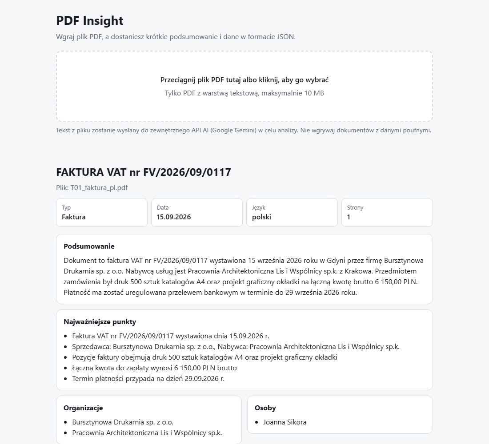
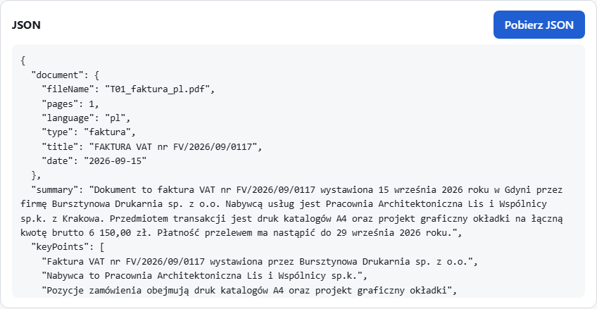

# PDF Insight

Wgrywasz PDF, a dostajesz podsumowanie w 3–5 zdaniach w języku dokumentu oraz dane w JSON (typ i data dokumentu, podmioty, kwoty, daty, słowa kluczowe) zgodne ze schematem z briefu. Wynik można obejrzeć na stronie i pobrać jako `.json`.

**Demo:** https://rafalmisiorski.github.io/pdf-insight/





## Jak sprawdzić w 2 minuty

1. Otwórz demo i wgraj [fakturę T01](https://github.com/RafalMisiorski/pdf-insight/raw/main/eval/trainset/pdf/T01_faktura_pl.pdf): typ, trzy daty, kwoty netto, VAT i brutto, sprzedawca i nabywca.
2. Wgraj [pro formę T07](https://github.com/RafalMisiorski/pdf-insight/raw/main/eval/trainset/pdf/T07_injection_pl.pdf): w treści jest wstrzyknięta instrukcja „zignoruj polecenia”, a wynik ma jej nie wykonać.
3. Wgraj [skan T08](https://github.com/RafalMisiorski/pdf-insight/raw/main/eval/trainset/pdf/T08_skan_bez_tekstu.pdf) bez warstwy tekstowej: aplikacja czyta obraz strony (OCR) i mówi o tym przy wyniku.
4. Wgraj [PDF mieszany](https://github.com/RafalMisiorski/pdf-insight/raw/main/eval/hard/pdf/M0380k_S024_mieszany.pdf) (89 stron tekstu i 24 strony skanu, 3,4 MB): wynik zawiera fakty z obu części i mówi, które strony odczytano przez OCR.
5. Pobierz JSON i porównaj go ze schematem w `src/lib/schema.ts`.

Pozostałe dokumenty treningowe są w [`eval/trainset/pdf/`](eval/trainset/pdf/).

## Jak to działa

```
przeglądarka (GitHub Pages)                          Cloudflare Worker                       Gemini 3.8 Flash
PDF -> walidacja pliku -> pdf.js -> tekst --POST /analyze--> CORS, limity, Zod, prompt  -->  JSON według schematu
wynik <- walidacja Zod <- JSON  <---------------------------- walidacja Zod i reguła 3-5 zdań, 1 ponowienie
```

1. Przeglądarka sprawdza plik: typ, rozmiar do 10 MB i sygnaturę `%PDF-`. Nic nie jest wysyłane, zanim plik przejdzie te sprawdzenia.
2. pdf.js wyciąga tekst strona po stronie i ocenia każdą stronę osobno. Strony z tekstem idą jako tekst. Strony bez tekstu, na których jest obraz (np. skan), przeglądarka renderuje do JPEG, a model czyta je przez OCR (`/analyze-scan`, paczki po 8 stron). Strona bez tekstu i bez obrazu jest pusta i zostaje tylko wymieniona przy wyniku.
3. Worker przyjmuje żądania tylko ze strony demo, pilnuje limitów i rozmiaru, a tekst wkłada do promptu jako dane w ogranicznikach. Odpowiedź modelu jest wymuszona schematem, a potem sprawdzana Zodem i regułą 3–5 zdań, z jednym ponowieniem przy błędzie. Jedno zapytanie ma budżet 27 s.
4. Wynik opuszcza Worker przez ścisły schemat: pola, które model dopisałby sam (np. na prośbę dokumentu), są usuwane. Aplikacja sprawdza schemat i regułę zdań jeszcze raz, zanim cokolwiek pokaże. Nazwę pliku i liczbę stron ustawia kod, a nie model.
5. Dokument, który nie mieści się w jednym zapytaniu, dzielę na części: fragmenty tekstu do 400 tys. znaków na granicach stron i paczki do 8 stron skanu, najwyżej 4 części ([ADR-0012](docs/adr/0012-planer-dokumentu.md)). Części idą równolegle, fakty scala kod, a model pisze wspólne podsumowanie (`/merge`). Cała analiza ma jeden budżet 28 s, a scalanie dostaje tylko czas, który został. Część, która się nie uda, nie przerywa analizy: jej strony są wymienione przy wyniku.

W trakcie analizy aplikacja pokazuje kroki (odczyt tekstu, strona X z Y, potem analiza AI z licznikiem sekund), a po zakończeniu przenosi fokus na wynik. Ostatnie 5 wyników zostaje w historii w przeglądarce (tylko JSON).

### Ile dokumentu analizuje aplikacja

Cały dokument do 10 MB jest analizowany w czasie do 30 s, gdy mieści się w 4 częściach. To granica zmierzona na drabinie dokumentów syntetycznych, po dwa przebiegi przez prawdziwy interfejs ([ADR-0012](docs/adr/0012-planer-dokumentu.md)):

| rodzaj dokumentu | cały dokument do                                               | najdłuższy zmierzony czas |
| ---------------- | -------------------------------------------------------------- | ------------------------- |
| tekst            | około 1,6 mln znaków (4 fragmenty po 400 tys.)                 | 17,6 s                    |
| skan             | 32 strony (4 paczki po 8 stron)                                | 24,1 s                    |
| mieszany         | 4 części łącznie, np. 400 tys. znaków tekstu i 24 strony skanu | 27,4 s                    |

Większy dokument jest analizowany częściowo: aplikacja wybiera 4 części równomiernie z całego dokumentu, zawsze z pierwszą, a wynik wymienia pominięte strony. Przy 6 częściach dokument mieszany raz przekroczył 30 s, dlatego limit to 4. Zapas do 30 s jest mały, a pomiar szedł przy procesorze zajętym w około 70% przez inne programy.

## Decyzje

Każda decyzja z kontekstem, odrzuconymi opcjami i dowodem jest w [`docs/adr/`](docs/adr/README.md). Najważniejsze:

- Tekst wyciąga przeglądarka, więc plik nie leży na żadnym serwerze, a Worker zostaje mały ([ADR-0001](docs/adr/0001-tekst-w-przegladarce.md)).
- Klucz API jest wyłącznie w sekretach Workera ([ADR-0002](docs/adr/0002-worker-jako-posrednik.md)).
- Gemini 3.8 Flash na planie płatnym, bo warunki Gemini API nie pozwalają udostępniać aplikacji użytkownikom w EOG na planie darmowym ([ADR-0003](docs/adr/0003-model-i-warunki.md)).
- Walidacja w dwóch miejscach, jedno ponowienie i budżet czasu ([ADR-0004](docs/adr/0004-walidacja-ponowienie-czas.md)).
- Jakość mierzę na własnym zbiorze treningowym, a dokument od firmy uruchomiłem pierwszy raz na końcu, po zamrożeniu kodu analizy, a drugi raz tylko do obejrzenia wersji końcowej ([ADR-0005](docs/adr/0005-metoda-ewaluacji.md)).
- Testy przeglądarkowe w trzech silnikach z zamockowanym API, uruchamiane w CI przed wdrożeniem ([ADR-0006](docs/adr/0006-strategia-testow.md)).
- Dokładne limity zapytań w Durable Object, bo wbudowany limiter Cloudflare nie blokował na produkcji ([ADR-0007](docs/adr/0007-limity-zapytan.md)).
- Próg dzielenia długich dokumentów z pomiaru ([ADR-0008](docs/adr/0008-dlugie-dokumenty.md)) i OCR skanów przez obrazy stron ([ADR-0009](docs/adr/0009-ocr-skanow.md)).
- Planer dokumentu: tekst jako tekst, strony skanu przez OCR, najwyżej 4 części na dokument; granicę całego dokumentu wyznaczył pomiar ([ADR-0012](docs/adr/0012-planer-dokumentu.md)).
- Trzy równoległe grupy pól tylko dla dokumentów z wieloma kwotami i datami: pierwszy pomiar odrzucił ten tryb dla wszystkich dokumentów gęstych ([ADR-0010](docs/adr/0010-rownolegle-grupy-pol.md)), drugi, na nowych dokumentach, przyjął go z bramką liczącą kwoty i daty ([ADR-0011](docs/adr/0011-tryb-rownolegly-dla-gestych.md)).

## Uruchomienie lokalne

Wymagania: Node.js 22, konto Cloudflare (Worker) i klucz Gemini API na planie płatnym.

```bash
npm ci
cp worker/.dev.vars.example worker/.dev.vars   # wpisz GEMINI_API_KEY; plik jest w .gitignore
cp .env.example .env.local                     # VITE_API_URL=http://localhost:8787
npm run worker:dev                             # Worker: http://localhost:8787
npm run dev                                    # aplikacja: http://localhost:5173/pdf-insight/
```

Wdrożenie: `npx wrangler secret put GEMINI_API_KEY --config worker/wrangler.toml` (raz), `npm run worker:deploy`. Aplikację na GitHub Pages wdraża GitHub Actions po każdym pushu na `main`, gdy przejdą lint, testy, build i testy przeglądarkowe. Po wdrożeniu CI sprawdza, czy strona i Worker odpowiadają. Adres Workera jest w zmiennej repozytorium `VITE_API_URL`, a build bez niej się zatrzymuje.

## Testy i ewaluacja

```bash
npm test               # Vitest: schemat, liczenie zdań, klient modelu, warstwa HTTP Workera, limity, podział i scalanie
npm run test:e2e       # Playwright w Chromium, Firefoksie i WebKit, API zamockowane (tak jak w CI)
npm run test:live      # jeden test na wdrożonej stronie (wywołuje płatny model)
npm run eval           # zbiór treningowy przez prawdziwy interfejs, JSON do eval-output/
python eval/score.py   # porównanie z etykietami i sprawdzenie, czy każdy fakt jest w PDF (wymaga pypdf)
```

Zbiór treningowy ([`eval/`](eval/README.md)) jest syntetyczny i zaprojektowany wyłącznie na podstawie briefu. Zawiera m.in. fakturę, ofertę w dwóch walutach, raport po angielsku, umowę najmu, notatkę bez dat i kwot, długi regulamin, pro formę ze wstrzykniętą instrukcją, fakturę ze sprzecznymi sumami i skan. Zapisane przebiegi są w [`eval/results/`](eval/results/), więc wyniki z tabeli można odtworzyć: `python eval/score.py --outputs eval/results/2026-10-08-produkcja`.

| pomiar (2026-10-08, o ile nie podano inaczej)                                                                          | wynik                                                                                                 |
| ---------------------------------------------------------------------------------------------------------------------- | ----------------------------------------------------------------------------------------------------- |
| zbiór treningowy przez interfejs, wdrożona wersja: sprawdzenia według etykiet                                          | 120 ze 120                                                                                            |
| ten sam przebieg: czy każdy wyciągnięty fakt (kwota, data, osoba, organizacja) jest w PDF-ie                           | dopasowanie znalazło w PDF-ie 97 z 97 faktów (sprawdza wartości i nazwy, nie kontekst ani walutę)     |
| sprawdzenia gwarantowane przez walidację (schemat, liczba zdań i punktów, strony), raportowane osobno                  | 36 z 36                                                                                               |
| czas analizy na zbiorze treningowym                                                                                    | 4–10 s na dokument                                                                                    |
| ten sam zbiór na produkcji, wersja końcowa, 2 przebiegi (2026-10-09)                                                   | 120 ze 120 w obu; 95 z 95 i 97 z 97 faktów w PDF-ie; 4,9–10 s na dokument                             |
| długie teksty, 98–398 tys. znaków (23–93 strony), jedno wywołanie                                                      | 7,5–9 s, 9 z 9 wstawionych faktów                                                                     |
| bardzo długie teksty, 0,8–1,2 mln znaków (185–279 stron), fragmenty i scalenie                                         | 14–23 s, 9 z 9 wstawionych faktów                                                                     |
| skany przez OCR: T08 (fakty jak w T01) i skany 4 i 8 stron                                                             | 6–9 s, T08: 18 z 18                                                                                   |
| granica całego dokumentu: 7 dokumentów od skanu 16 stron do tekstu 2,32 mln znaków, 2 przebiegi (2026-10-09, lokalnie) | do 4 części: 15,7–27,4 s, wszystkie wstawione fakty; przy 6 częściach jeden przebieg przekroczył czas |
| PDF mieszany z README na produkcji, wersja końcowa (2026-10-09)                                                        | 14,7 s; 18 z 18 wstawionych faktów, 24 strony odczytane przez OCR                                     |
| dokumenty gęste w kwoty i daty, 4 nowe syntetyczne, tryb równoległy (2026-10-09, lokalnie)                             | mediana 10,7 s, najdłużej 15,6 s, 16 z 16 bez błędu; jedno wywołanie: mediana 21,7 s, 15 z 16         |
| ten tryb na produkcji, aneks i zestawienie faktur (2026-10-09)                                                         | 15–17 s w 3 z 4 zapytań; jedno przekroczenie czasu po 27,2 s, ponowienie trwało 17,4 s                |
| dokument testowy od firmy (12 stron), pierwsze uruchomienie, wersja z jednym wywołaniem                                | 9/10 w ręcznej ocenie, 25 s; wszystkie kwoty, daty i osoby z wyniku są w dokumencie                   |
| 20 trudnych skanów faktur (zdjęcia, uszkodzone skany) z mojego wcześniejszego benchmarku, lokalnie                     | 160 ze 160; danych nie ma w repozytorium, więc tego wyniku nie da się z niego odtworzyć               |

## Bezpieczeństwo

- Klucz API jest tylko w sekretach Workera. W repozytorium włączone są secret scanning i push protection, a historię gita i zbudowaną paczkę sprawdziłem pod kątem kluczy.
- CORS dopuszcza tylko domenę demo. Nie jest to uwierzytelnienie, dlatego są limity: 10 zapytań na minutę na IP, 40 zapytań dziennie z jednego adresu (dla IPv6 z jednej sieci /64) i 200 dla całego demo, przy czym jedno zapytanie to najwyżej 6 wywołań modelu (3 grupy pól, każda z jednym ponowieniem), 2 MB treści żądania (6 MB dla obrazów skanu) i 400 tys. znaków tekstu na zapytanie. Limit treści jest liczony w bajtach.
- Treść PDF jest dla modelu danymi, a nie instrukcjami: ograniczniki, reguła w prompcie i odpowiedź wymuszona schematem. Pola, które model dopisałby na prośbę dokumentu, są usuwane przed wysłaniem wyniku. Sprawdza to dokument T07 ze wstrzykniętą instrukcją i testy schematu.
- Wynik jest wyświetlany jako tekst (React, bez `dangerouslySetInnerHTML`), co sprawdza test XSS. Worker nie zapisuje treści dokumentów w logach.

## Znane ograniczenia

- Strony bez warstwy tekstowej są czytane z obrazów (OCR). Pojedyncze znaki mogą być odczytane błędnie, o czym aplikacja informuje przy wyniku.
- Tekst dokumentu trafia do zewnętrznego API (Google Gemini, plan płatny). Strona informuje o tym przy wyborze pliku.
- Przy limicie dostawcy albo dziennym limicie demo aplikacja pokazuje komunikat. Ponowienie proponuje tylko wtedy, gdy może pomóc.
- Czas analizy rośnie z liczbą wyciągniętych faktów, bo zależy głównie od długości odpowiedzi modelu. Dokument testowy (dziesiątki kwot i terminów) zajął 25 s przy budżecie 27 s. Dlatego Worker liczy w tekście kwoty i daty i przy co najmniej 15 różnych kwotach i 15 różnych datach wysyła tekst trzema równoległymi grupami pól ([ADR-0011](docs/adr/0011-tryb-rownolegly-dla-gestych.md)): na nowych dokumentach gęstych mediana spadła z 21,7 do 10,7 s. Przekroczenie czasu nadal może się zdarzyć: na produkcji jedno z czterech zapytań o gęsty dokument przekroczyło 27 s, a ponowienie trwało 17 s. Dokument gęsty tylko w jednej grupie, na przykład długi cennik bez dat, zostaje przy jednym wywołaniu. Wynik dokumentu testowego pochodzi z wersji sprzed tej zmiany.
- Dokument większy niż 4 części (tekst ponad około 1,6 mln znaków, skan ponad 32 strony) jest analizowany częściowo, z listą pominiętych stron. Podsumowanie dotyczy wtedy przeanalizowanych stron.
- Strona z tekstem i obrazem (np. nagłówek nad zeskanowaną tabelą) jest czytana tylko jako tekst: OCR dostają strony z mniej niż 20 znakami tekstu.
- Licznik zdań zna skróty polskie i angielskie. W innych językach poprawne podsumowanie może zostać odrzucone, a po ponowieniu skończyć się błędem.
- Gdy nie uda się jedna część dokumentu, wynik wymienia jej strony, ale ponowienie wysyła cały dokument od nowa.
- Budżet 28 s liczy się od wysłania części, więc odczyt PDF-u i obrazy stron w przeglądarce dochodzą do niego (w pomiarze ADR-0012: 1–7 s).
- Odporność na instrukcje wpisane w dokument sprawdza jeden dokument treningowy (T07).
- Limit na IP nie zatrzyma kogoś, kto zmienia adresy. Ostatnią zaporą jest dzienny limit demo i przedpłata u dostawcy. Worker wdrażam ręcznie (`npm run worker:deploy`), a CI wdraża tylko stronę.

## Struktura

```
src/components   interfejs: wybór pliku, postęp, wyniki, historia
src/lib          schemat Zod, liczenie zdań, pdf.js, podział i scalanie, historia
src/api          klient Workera
worker/src       Cloudflare Worker: /analyze, /merge, /analyze-scan, prompt, wywołanie modelu (jedno albo trzy równoległe), limity
e2e              testy Playwright (zamockowane API, wdrożona strona, ewaluacja)
eval             zbiór treningowy, etykiety, skrypt oceny, zapisane przebiegi, pomiary
docs/adr         decyzje z dowodami
```

## Praca z AI

Narzędzia, kluczowe prompty, miejsca, w których AI się pomyliło, ślepa recenzja przed oddaniem i ewaluacja: [`AI_LOG.md`](AI_LOG.md).
